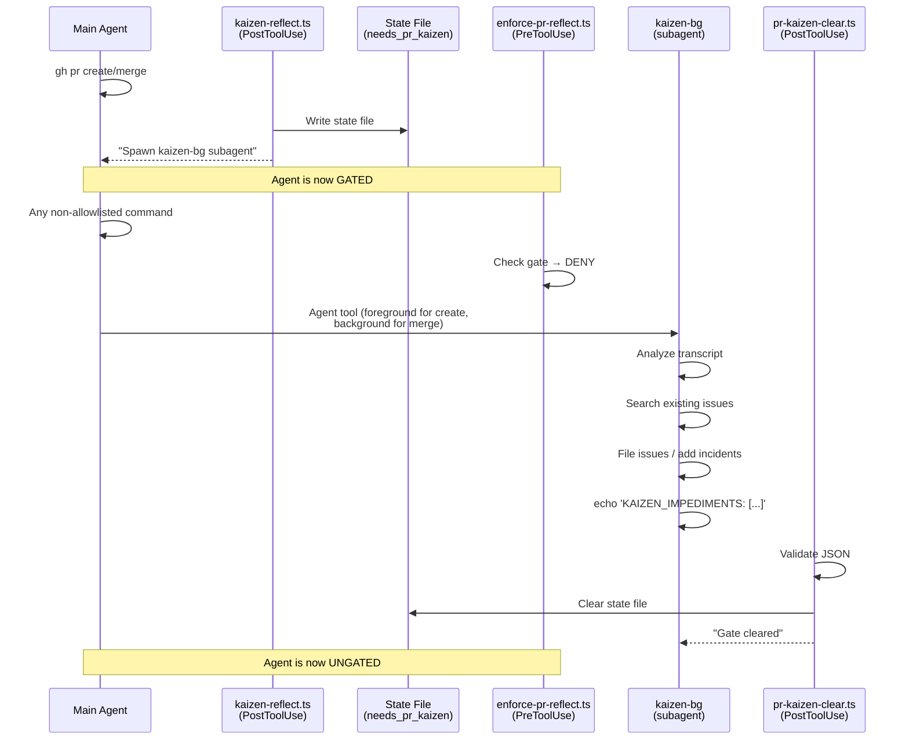

# Hooks Design — Patterns, Anti-Patterns, and Lessons Learned

This document captures hard-won knowledge about the Claude Code hooks system. It's the reference for anyone writing, debugging, or maintaining hooks. Last verified: 2026-03-24.

> **Hook inventory:** See [`.agents/kaizen/docs/hook-catalog.md`](../.agents/kaizen/docs/hook-catalog.md) for the complete hook list, gate patterns, and TS migration status. This doc covers **how to write hooks**, not which hooks exist.

## Architecture

### Two Independent Systems: Permissions vs Hooks

Claude Code has two enforcement layers that are often confused:

| System | Flag to bypass | What it does |
|--------|---------------|--------------|
| **Permissions** | `--dangerously-skip-permissions` | Auto-approves built-in "Allow this tool?" prompts |
| **Hooks** | `--bare` | Disables custom PreToolUse/PostToolUse/Stop scripts |

**Critical:** `--dangerously-skip-permissions` does NOT bypass hooks. Custom hook `permissionDecision: "deny"` responses still fire and block. This was discovered in kaizen #323 when overnight-dent runs (which use `--dangerously-skip-permissions`) were still blocked by kaizen gates.

`--bare` disables hooks BUT also disables CLAUDE.md, skills, LSP, and other infrastructure. It's a nuclear option, not a surgical one.

### Hook Event Lifecycle

```
User/Agent action
  → PreToolUse hooks fire (can DENY — blocks the action)
  → Tool executes (if not denied)
  → PostToolUse hooks fire (advisory — can set gates but not block retroactively)
  → Stop hooks fire (when agent tries to finish — can block completion)
```

### Gate Pattern

Gates are the primary control flow mechanism:

1. **PostToolUse** creates a state file (e.g., `needs_pr_kaizen`)
2. **PreToolUse** checks for the state file and denies non-allowlisted commands
3. An allowlisted action clears the state file
4. **Stop** hook prevents the agent from finishing with pending gates

This creates a "you must do X before you can do Y" enforcement.

### Outcome Verification Contract (kaizen #950, #943)

**A gate clears on a verified outcome, not on a command-shaped declaration.**

The category error (#943): every gate originally fired on command *invocation*. A review
gate cleared when it saw `gh pr create` in a tool call — not when a PR was actually created
and reviewed. An agent could satisfy a gate by issuing the gated command in a context where
it fails silently, or by emitting a declaration whose claimed effect never happened. This is
how #843 shipped 25 PRs with zero review: the gate detected the command, not the outcome.

**The contract:** every clearing path declares the *outcome predicate* it verifies, and
checks it before clearing. Verification has three results, and the fail direction matters:

| Result | Meaning | Gate behavior |
|--------|---------|---------------|
| `exists` / verified | the claimed effect is real | **clear** |
| `missing` / refuted | tool resolved cleanly, effect absent | **fail closed** — keep the gate |
| `unverifiable` | parse failure, no target, network/auth error | **fail open** — clear, but log |

Fail-open on `unverifiable` is deliberate: a flaky network must never deadlock an autonomous
run. Fail-closed on a *definitive* refutation is the whole point — a fabricated outcome
cannot clear the gate. Make the predicate injectable so tests exercise all three results
without a live network (see `pr-kaizen-clear.ts`'s `verifyRef` option and
`src/hooks/lib/issue-ref-verifier.ts`).

#### Gate audit — outcome verification status

| Gate (file) | Trigger | Outcome predicate | Status |
|-------------|---------|-------------------|:------:|
| `pr-review-loop.ts` | `gh pr diff` for a round | review **sentinel** written by `store-review-summary` (findings stored) — `gh pr diff` alone does not clear (#920) | ✅ verifies outcome |
| `bump-plugin-version.ts` | `gh pr create` | manifest version is incremented vs `main` (auto-bumps + pushes if not — guarantees the effect) | ✅ ensures outcome |
| `pr-kaizen-clear.ts` | `KAIZEN_IMPEDIMENTS` | JSON validates **and** every `filed`/`incident` `ref` resolves to a real issue/PR (#950) | ✅ verifies outcome |
| `enforce-plan-stored.ts` | Edit/Write/`gh pr create` | a plan attachment exists on `git config kaizen.issue` (checked via the Case FE, not command text) | ✅ verifies outcome |
| `pre-push.ts` | `git push` | reads real git state (merged-branch / remote ref); content-level, not command-string | ✅ verifies outcome |
| `check-dirty-files.ts` | `gh pr create` | per-file `git diff --quiet HEAD` content check (#1073), not stat | ✅ verifies outcome |

When adding a gate, fill in its row. A gate that only matches a command string and has no
outcome predicate is the #943 anti-pattern — name the effect it should verify and check it.

### Kaizen Reflection Flow (kaizen #794)

The reflection gate uses the gate pattern with a subagent for automated issue filing:



Key design decisions:
- **PR create**: subagent runs in foreground (agent is fully gated, nothing else to do)
- **PR merge**: subagent runs in background (agent can do allowlisted post-merge steps: main sync, deploy)
- **kaizen-bg echoes KAIZEN_IMPEDIMENTS directly** — gate clears mechanistically without main agent relaying results (kaizen #794)
- **KAIZEN_BG_RESULTS** accepted as alternate trigger format (fallback)

## Writing Hooks

### Language Boundaries

See [`hook-language-boundaries.md`](hook-language-boundaries.md) for the full policy. Summary:

- **TypeScript** is the default for all hook logic. Testable, type-safe, and maintainable.
- **Bash shims** (~5 lines) are the execution entry point that Claude Code invokes. They delegate to TS.
- **Remaining bash hooks (advisory-only) are now consolidated into `pr-quality-checks.ts`. Any hook with branching logic or state management should be in TypeScript.
- Never mix languages within a single hook's logic — use a trampoline.

### Trampoline Pattern

All enforcement hooks use a thin bash wrapper that delegates to TypeScript
through the shared `run-tsx.sh` resolver:

```bash
#!/bin/bash
# kaizen-some-hook-ts.sh — trampoline to TypeScript implementation
source "$(dirname "$0")/lib/scope-guard.sh"
source "$(dirname "$0")/lib/run-tsx.sh" 2>/dev/null || { exit 0; }
run_tsx "$KAIZEN_DIR" "$KAIZEN_DIR/src/hooks/some-hook.ts"
```

The bash shim handles scope-guard and production dispatch. `run-tsx.sh`
honors `KAIZEN_TSX_BIN` first for deterministic test harnesses. In production
it prefers precompiled `node dist/...` output only when `npm run build` has
written `dist/.kaizen-hook-build` after all non-test `src/**/*.ts` files and
the matching compiled file exists. If the marker is missing or stale, it falls
back to resolving `tsx` from the kaizen checkout, parent worktree installs, or
git common dir through `resolve-tsx-bin.sh`. The shim intentionally avoids
`npx --prefix ... tsx` in production hook paths because missing dependencies
produced opaque non-blocking hook failures (#1131) and because `npx` adds
startup overhead.

Current #454 measurement on this host after `npm run build`:

| Launcher | Five-run wall time | Max RSS | Decision |
|---|---:|---:|---|
| `pr-review-loop-ts.sh` via `run-tsx.sh` shared resolver | 0.54-0.90s | 107-117 MB | Source fallback when dist is stale or unavailable |
| Direct `npx tsx src/hooks/pr-review-loop.ts` | 0.68-0.88s | 108-114 MB | Avoid in production shims |
| `npx --no-install tsx src/hooks/pr-review-loop.ts` | 0.62-0.65s | 112-118 MB | Similar to resolver but less worktree-aware |
| `npx -y bun src/hooks/pr-review-loop.ts` | 0.59-0.68s | 101-103 MB | Not a production win through `npx` |
| `node dist/hooks/pr-review-loop.js` | 0.10s | 63-65 MB | Fastest path when build marker is fresh |

Decision matrix:

| Runtime | Production decision | Contract |
|---|---|---|
| Precompiled Node | Prefer first when fresh | `npm run build` writes `dist/.kaizen-hook-build`; `run-tsx.sh` requires marker newer than non-test `src/**/*.ts` and a matching `dist/*.js` file |
| Source `tsx` | Required fallback | Shared resolver stays worktree-aware and fail-open when dependencies are missing |
| Bun | Do not use by default | `npx -y bun` is not a measured production win; adopting Bun would require a standard installed dependency instead of hot-path `npx` |

The TypeScript file handles all logic, reads stdin JSON, and writes stdout JSON.
This makes the logic fully testable with vitest.

### Hook Testability (kaizen #775)

TypeScript hooks follow a pattern that separates the testable core from the entry point:

```typescript
// Testable pure function — injected dependencies, no I/O
export function processHookInput(command: string, branch: string, stateDir?: string): Result { ... }

// Entry point — thin glue, not tested directly
async function main(): Promise<void> {
  const input = await readHookInput();
  const branch = getCurrentBranch();
  const result = processHookInput(input.tool_input?.command ?? '', branch);
  // ... write output
}
```

Shared utilities live in `src/hooks/hook-io.ts` (stdin/stdout, getCurrentBranch), `src/hooks/lib/allowlist.ts` (command allowlists), and `src/hooks/lib/gate-manager.ts` (unified stop gate logic).

### Regex Patterns — The Alternation Trap

**Anti-pattern (kaizen #323):**
```bash
grep -qE "^git[[:space:]]+${subcommand}"
# Where subcommand="diff|log|show|status|branch|fetch"
# Expands to: ^git[[:space:]]+diff|log|show|status|branch|fetch
# The | is top-level alternation! "branch" matches ANYWHERE in the string
```

**Correct pattern:**
```bash
grep -qE "^git[[:space:]]+(${subcommand})"
# Parentheses group the alternation: ^git[[:space:]]+(diff|log|show|...)
```

This bug caused `gh pr merge --delete-branch` to pass through readonly monitoring (the `branch` in `--delete-branch` matched the bare `branch` alternative). Always wrap variable alternation patterns in parentheses.

### Allowlist Design

When a gate blocks commands, it needs an allowlist of commands that ARE permitted during the gate.

**Principles:**
- Allowlist by **intent**, not by syntax. "PR workflow commands" not "commands containing `gh pr`"
- Include **all variants** of an allowed action. `gh pr merge 42`, `gh pr merge URL`, `gh pr merge --squash` are all the same intent
- **Segment-split** before matching (kaizen #172). Commands chained with `|`, `&&`, `;` must have each segment checked independently. Otherwise `npm build && echo KAIZEN_IMPEDIMENTS:` bypasses the gate
- Use `is_gh_pr_command`, `is_git_command` helpers — they handle segment splitting

### State File Conventions

- **Location:** `$STATE_DIR` (defaults to `/tmp/.pr-review-state/`)
- **Format:** `KEY=value` lines (parseable with `grep` + `cut`)
- **Required fields:** `PR_URL`, `STATUS`, `BRANCH`
- **Branch scoping:** State files include `BRANCH=` so hooks can filter to the current worktree
- **Cross-branch lookup:** Active declarations (KAIZEN_IMPEDIMENTS) use `_any_branch` variants since the agent may submit from a different worktree
- **Staleness:** Files older than `MAX_STATE_AGE` (2 hours) are ignored

### Direct Hook Smoke Tests

Directly invoking a TS hook binary is not the same as running through the real
hook wrapper. State-writing hooks refuse to write to the shared default
`/tmp/.pr-review-state` unless one of these is true:

- `STATE_DIR` is set explicitly, preferably `STATE_DIR=$(mktemp -d)` for smoke
  tests and local repros.
- A real wrapper has exported `KAIZEN_TRUST_DEFAULT_STATE_DIR=1` before
  dispatching the TS hook.
- An operator deliberately sets `KAIZEN_ALLOW_DEFAULT_STATE_DIR=1` for an
  emergency manual write.

Use an isolated state dir in every direct smoke:

```bash
STATE_DIR=$(mktemp -d) CLAUDECODE=1 \
  npx tsx src/hooks/pre-push.ts origin https://github.com/Garsson-io/kaizen
```

### Testing Hooks

**TypeScript hooks (preferred):**
- Each TS hook has a co-located `.test.ts` file (e.g., `enforce-pr-review.test.ts`)
- Tests use injected `stateDir` and `currentBranch` params — no real filesystem or git needed
- Run with `npx vitest run src/hooks/`

**Bash hooks (legacy/advisory):**
- Each bash hook has `test-{hook-name}.sh` in `.claude/hooks/tests/`
- Integration tests: `test-hook-interaction-matrix.sh` tests cross-hook behavior
- Run with `npm run test:hooks`

**Shared principles:**
- **Test isolation:** Tests override `STATE_DIR` to a temp directory. Never rely on real state files
- **Mock `gh`:** Create a mock `gh` script in a temp dir and prepend to `PATH`
- **Always test both paths:** the "allowed" path AND the "denied" path
- **Shared lib changes require E2E tests:** Use `SessionSimulator` (`src/e2e/session-simulator.ts`) to fire hooks in session order with controlled environments
- **TypeScript E2E harness:** `src/e2e/hook-runner.ts` provides event builders, `runHook()`, and mock utilities
- **Session hook registries are manifest-derived:** `SessionSimulator` loads `.claude-plugin/plugin.json` through `loadDefaultHookRegistry()`. Do not hand-maintain a parallel full hook list in E2E tests; narrow `session.hooks` only when the test intentionally exercises a focused subset.
- **Hook subprocess tests should be deterministic in worktrees:** use `resolveTsxBin()` from `src/e2e/test-runtime.ts` for TypeScript E2E tests, pass `KAIZEN_TSX_BIN` to bash trampolines when invoking them from test harnesses, and disable advisory background noise with `HOOK_TIMING_SENTINEL_DISABLED=true` and `SEND_TELEGRAM_IPC_DISABLED=true`.
- **Do not silently skip outcome-proof tests:** if an outcome E2E test requires `tsx`, assert that it is present and fail loudly. Skip guards are acceptable for live fixtures whose subject is explicitly optional local infrastructure.
- **Production best-effort hooks use the shared trampoline:** `run-tsx.sh`
  first supports `KAIZEN_TSX_BIN` for tests, then uses precompiled `node
  dist/...` only when `dist/.kaizen-hook-build` proves the build is fresh, then
  falls back through `resolve-tsx-bin.sh` to a usable `tsx` binary without
  `npx`, and finally fails open with an actionable diagnostic when
  dependencies are missing.

## Anti-Patterns

### 1. Assuming `--dangerously-skip-permissions` Disables Hooks
It doesn't. See "Two Independent Systems" above.

### 2. Unparenthesized Regex Alternation
`grep -qE "^prefix${var}"` where `var` contains `|` creates top-level alternation. Always use `(${var})`.

### 3. Gate Without Allowlist
A gate that blocks ALL commands forces the agent to clear the gate before doing anything — including commands needed to clear the gate. Always include the clearing action in the allowlist.

### 4. Branch-Scoped Lookup for Active Declarations
When an agent actively submits something (KAIZEN_IMPEDIMENTS), use `_any_branch` variants. The agent may have switched worktrees since the gate was created.

### 5. Testing Against Real State
Tests that don't override `STATE_DIR` will interact with real gates from other sessions, producing flaky results that depend on system state.

### 6. Silent Failures in Advisory Hooks
PostToolUse hooks that set gates should log what they're doing. Silent gate creation leads to mysterious blocks later.

### 8. YAML Gate Signals (#1049)

Hooks that set or clear gates emit a structured YAML block in their stdout. The YAML *is* the human-readable output — it's designed to be read by both machines and humans:

```yaml
---
gate: needs_review
action: set
pr: https://github.com/.../pull/42
round: 1
reason: PR created — mandatory self-review loop starts now
---
```

Schema: `src/hooks/lib/gate-signal.ts` (Zod-validated `GateSignal` type). Use `formatGateSignal()` to emit; `parseGateSignal()` to extract from hook output.

**Why YAML?** Humans read hook output in the terminal. YAML is readable at a glance — `gate: needs_review` / `action: set` / `reason: ...` tells the whole story. JSON requires mental parsing. Regex on prose is fragile (see #1049: three false-positive bugs from instructional text matching gate keywords).

**All gate-transitioning hooks emit YAML as their primary output:** `pr-review-loop.ts` (set/clear needs_review), `kaizen-reflect.ts` (set needs_pr_kaizen), `pr-kaizen-clear.ts` (clear needs_pr_kaizen), `post-merge-clear.ts` (set/clear needs_post_merge).

Some hooks (e.g. `kaizen-reflect.ts`) append operational context after the YAML block (timing reports, agent instructions). This is not a gate signal — it's context for the agent to act on. The `parseGateSignal` function extracts only the `---`-delimited YAML block.

The Hook Gym stream parser (`scripts/hook-gym-stream.ts`) tries YAML first, falls back to regex for hooks that don't set/clear gates.

### 7. Heavy Subprocesses in Accumulating Hooks (#474)
Never spawn heavy subprocesses (vitest, tsc, npm test, npx) in hooks that can fire multiple times without blocking the AI. Stop hooks retry on exit 2, PostToolUse hooks fire on every tool call, advisory PreToolUse hooks don't block — all of these can accumulate unboundedly.

**Safe:** PreToolUse hooks that deny (blocks AI, prevents re-invocation).
**Unsafe:** Stop hooks, PostToolUse hooks, any hook that doesn't prevent further invocations.

For unsafe positions, use the **marker pattern**: a skill or explicit tool call does the heavy work and writes a marker file. The hook only checks the marker.

### 8. Blocking ALL Tools to Force a Fix (#758)

A hook that blocks every tool call (including Bash, Edit, Write, and Stop) to force the user to take a corrective action creates an **unescapable deadlock**: the agent cannot run the fix because the fix itself is blocked.

**Wrong:** Detect bad state → print fix instructions → `exit 2` (blocks all tools)

```bash
# WRONG — agent cannot run the fix command; user must escape to a separate terminal
if [ "$bad_state" = "yes" ]; then
  echo "FIX: run python3 ..." >&2
  exit 2   # blocks everything, including the fix command
fi
```

**Correct:** Detect bad state → auto-fix it → warn via stderr → `return 0` (allow through)

```bash
# CORRECT — fix it automatically, warn, continue
if [ "$bad_state" = "yes" ]; then
  python3 -c "...fix script..."   # self-heal
  echo "[kaizen] WARNING: auto-fixed bad state" >&2
  return 0   # allow the tool call through
fi
```

The rule: **if a hook detects a state that needs fixing, fix it — don't just describe the fix and block**. A warning on stderr (exit 0) informs without trapping.

**Also applies to lint rules:** Code quality checks (detecting anti-patterns in source files) belong in **ESLint / `npm run lint` / CI**, never in a PreToolUse(Bash) hook. A hook fires on every tool call; a lint rule fires only when source files change. Wrong tool for the job produces noise and latency without benefit.

## State-reading discipline (#1073 / #240)

Hooks that inspect git working-tree state MUST route through
`src/hooks/lib/git-state.ts`. Historical false-positives (#232, #721, #871,
#1073) share two root causes — cwd drift and stat-vs-content disagreement —
both neutralised by the primitive:

- **`resolveTargetWorktree(cmdLine, fallbackCwd)`** — extracts the directory
  the *gated command* will run in from `git -C <path>`, `cd <path> && …`,
  `(cd <path> …)`, and quoted variants. Falls back to the passed-in cwd.
  Anchors every subsequent git call via `-C <target>`.
- **`readDirtyFiles(targetDir)`** — runs `git status --porcelain` then
  verifies each flagged tracked file with `git diff --quiet HEAD -- <file>`.
  Files whose content matches HEAD are filtered out (content truth overrides
  stat-only porcelain claims).
- **`formatDiagnostic(ctx)`** — stable diagnostic block in every deny
  message: `[cwd]`, `[target]`, `[target-source]`, `[git-dir]`,
  `[porcelain]`, per-file `[diff-index]`. Failure modes are debuggable from
  the transcript alone.
- **`isBypassRequested(env)`** — documented escape hatch. Agents that
  believe the hook is wrong set `KAIZEN_ALLOW_DIRTY_FILES=1`; the bypass
  is logged to stderr and must be followed by a kaizen issue pasting the
  diagnostic block.

A CI invariant in `src/hooks/lib/git-state-invariant.test.ts` fails the
build if a new hook file calls `execSync('git …')` without importing from
`./lib/git-state.js`. Hooks whose migration is pending live in the
`OPT_OUT` set in that test; removing an entry without migrating the hook
re-introduces the anti-pattern and breaks CI.

## Lessons Learned

| Incident | Lesson | Kaizen |
|----------|--------|--------|
| `--delete-branch` matched `branch` in regex | Always parenthesize regex alternation variables | #323 |
| `--dangerously-skip-permissions` didn't bypass gates | Permissions and hooks are independent systems | #353 |
| Stop hook ran vitest/tsc, OOM in 60s | No heavy subprocesses in hooks that can accumulate | #474 |
| Gate re-fired 3x for same PR in one session | Per-PR reflection markers needed | #288 |
| Cross-worktree gate clearing failed | Active declarations need `_any_branch` lookup | #239 |
| `npm build && echo KAIZEN_IMPEDIMENTS:` bypassed gate | Segment-split before matching | #172 |
| Hook tests flaky due to real state files | Always override `STATE_DIR` in tests | #309 |
| `.claude-plugin/plugin.json` phantom-staged, blocked PR create | Hooks must resolve the gated command's target worktree and verify porcelain with content-level diff (not stat) — see § State-reading discipline | #1073 |
| scope-guard blocked ALL tools → 10-message deadlock | Auto-fix bad state; warn don't block; lint ≠ hook | #758 |
